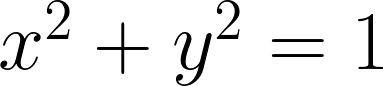

# Project 2: Binary Search Tree
### **Data Structures and Algorithms**

**Due:** End of exams (around May 7) \
**Submit:** Email the completed file BinarySearchTree.java

In this project, you will implement a _binary search tree_: a special type of binary tree that is used to quickly find, insert, and remove elements. 

**Requirements:**
* The class `BinarySearchTree` (BST) should use the appropriate binary search tree structure
* The BST should implement all the listed methods
* Your code should never crash
* You should follow the Java Coding Standards document

<div class="vs-sm"></div>

<hr>

## Binary Search Tree
**Note:** See the BST demo at [https://visualgo.net/en/bst](https://visualgo.net/en/bst)

A binary search tree is a binary tree where:
* every node has (at most) 2 children
* for every node, all nodes in the left subtree are smaller
* for every node, all nodes in the right subtree are larger

![[BST.png|200]]

This equation:  is for a circle

<div class="pb"></div>

## Representation
The tree is made up of Node objects, each node should consist of the following:
```
class Node {
    public int data;
    public Node left = null;
    public Node right = null;

    Node(int data) {
        this.data = data;
    }
}
```

The tree itself only has a reference to the root node. 

<hr>

## BST Search
To search for a value, we do a recursive search with the nodes. 
* If the current node's data is equal to the query, return true.
    * Otherwise, if the node's data is greater than the query, recursively search the left subtree
    * Otherwise, if the node's data is smaller than the query, recursively search the right subtree
* If we reach a null node, we return false. 

> This is a block quote by a great man
> This is a block quote by a great man
> This is a block quote by a great man
> This is a block quote by a great man
> This is a block quote by a great man
> This is a block quote by a great man


_Steps:_
1. Read Something
2. Plan Something
    1. Sketch
    2. Outline
    3. Write
3. Build Something

<div class="pb"></div>

|Name|Age|Occupation|
|----|---|----------|
|Dr. Aaron Mininger|34|Profesor of Computer Engineering|
|Abe Lawson|3|Being a toddler|
|Yuri Kim|31|The best girlfriend in the world|

![[BSTsearch.png|4.5in]]

<div class="pb"></div>

## Writing BST Methods
We often use recursion to write BST method. These will have 2 versions of the method: 
* The public method which the users can call
* A private method which takes a Node object and is recursive

For example, consider implementing the method `numLeaves()`, which returns the number of leaf nodes in the tree (a leaf is a node with 0 children):
```
public int numLeaves() {
    return numLeaves(this.root);
}

private int numLeaves(Node node) {
    if (node == null) {
        return 0;
    } else if (node.left == null && node.right == null) {
        return 1;
    } else {
        return numLeaves(node.left) + numLeaves(node.right);
    }
}
```

The recursive version has 2 base cases:
* The node is null, so return 0
* The node is a leaf, so return 1

The recursive step is to sum the number of leaves in the left subtree and the right subtree. 


<div style="page-break-after: always"></div>

#  BinarySearchTree Methods
The `BinarySearchTree` must implement the following methods: 

`int size()` \
Returns the count of how many nodes are in the tree

`boolean isEmpty()` \
Returns true if the tree is empty

`int height()` \
Returns the height of the tree (the maximum depth)

`boolean contains(int x)` \
Returns true if the tree contains the given value (false if not). 

`int min()` \
Returns the smallest value in the tree

`int max()` \
Returns the largest value in the tree

`void insert(int x)`\
Inserts the integer x into the tree. If it already exists, nothing happens. 

`void clear()` \
Removes all items from the tree

`List<Integer> toList()` \
Returns a List that contains all the integers in the tree in sorted order \
Hint: Have the recursive method take a list as a parameter and add to it

`String toString()` \
Returns a string that contains all the integers in the tree in sorted order
